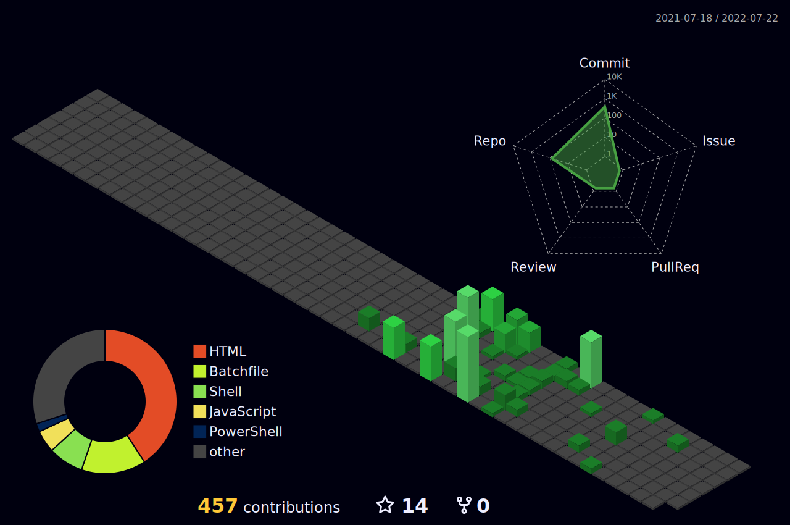

 
 
[<a href=https://tryhackme.com/p/cristiancmoises>]

# Hi there! How are you�
A README made with **Markdown**, *[great ideas](https://github.com/cristiancmoises) and   *   
## <> ᴀʙᴏᴜᴛ ᴍᴇ </>
#### Hi i'm  Cristian Cezar Moisés and I'm a Brazilian **developer**. I'm here on GitHub to:
***- Share my codes;***
***- Learn more about front-end and back end technologies;***
***- Contribute to third-party projects;***
***- Get inspiration and new ideas!***

Feel free to visit [my repositories](https://github.com/cristiancmoises?tab=repositories). Doubts or suggestions, please open an issue and let's talk!

---

---
## <📊> ɢɪᴛ ꜱᴛᴀᴛꜱ </📊>
 
 

 |  
| ----------- | ------------ |
---

## <📫> ʜᴏᴡ ᴛᴏ ʀᴇᴀᴄʜ ᴍᴇ </📫>
 
------
## 🤟𝘾𝙤𝙣𝙣𝙚𝙘𝙩 𝙒𝙞𝙩𝙝 𝙈𝙚: 

[<a href="https://cristiancezarmoises.github.io">]
[<a href="https://www.linkedin.com/in/cristiancezarmoises/"> ]
[<a href="https://medium.com/@cristiancezarmoises"> ]
[<a href="https://instagram.com/@lord.of.olympus"> ]

   

[<a href="https://gentoo.org"> ]
 

  [<a href="https://guix.gnu.org">]
  [<a href="https://gnu.org"> ]  
   
 
     
   
𝙇𝙖𝙨𝙩 𝙀𝙙𝙞𝙩𝙚𝙙 𝙤𝙣: 24/04/2023

